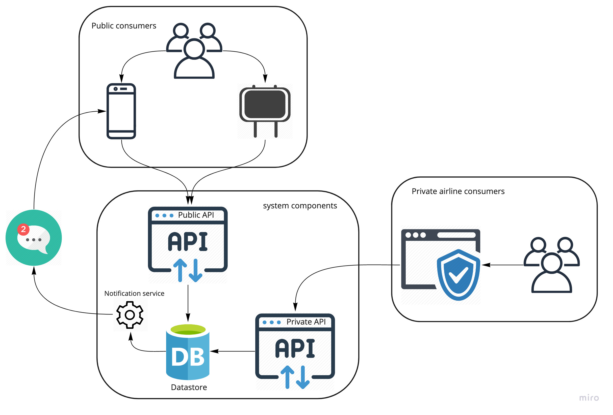

# Solution Design 

## How to consume this repo 📖
Thank you for taking the time to go through this solution design, below are a few guidelines:
* I have grouped sections into folders that have README files going in to a bit more detail about the section. Please be sure to go through all the sections to get a deeper understanding of the full picture.
* There are links to sections as you read that will take you to files or directories. I suggest reading through this entire page first before clicking through so you don't loose context. 
* Everything has been done in markdown so GitHub may be the best place to view this. Alternatively you can clone this repo and explore in your favourite editor.
* There a possibly some areas that I have not gone into as much detail as needed  or have totally missed some aspects.
* Your feedback is welcome.

## Context :small_airplane:
Airports have many flights departing on a daily basis. They are required to keep a schedule of the regular flights and all related information. Any changes made to the flights are amended on these schedules and are reflected appropriately. 

The flight schedule information needs to be centrally stored and accessible to travelers at the airport via a display board and an online interface.

Travelers can subscribe to notification about specific flight information changes.

Airlines will be able to independently update the information about the schedule as and when required via an interface only accesable by them.

# System Components

* [Web API for display board and Mobile devices](web-api/README.md)
* [Application for airline staff](airline-application/README.md)
* [Push notification services](push-notification-service/README.md)
* [AWS Infrastructure](aws-infrastructure/README.md)
* [CICD](cicd/README.md)

# Assumptions and Trade offs 🤔
* Alerts and monitoring is out of scope for this design.
* Details of the mobile application for users is out of scope.
* Existing flight infomation needs to be imported but that ETL process is out of scope.
* Message board is polling the web-api for data. 
* The provided *example*  code for the web api is not perfect and serves purely as an indication of how the tools and technology could be used.
* Current way of of ensuring airlines don't change the wrong data is not the best but it will work. 

# Timeline Forcast
 
 Given a cross funtional team of an approximate size of 5 the above solution can be devloped in 1 - 2 weeks. This implies that team slice's the work into verticle pieces of product value that can continuosly be deployed. Working in a Test First manner using practices like TDD and involving QA from the beginning will be prefered.  Forcasting is taking into consideration any interaptions and meetings teams will have to work through to get the product into a custumers hands and get feedback. 