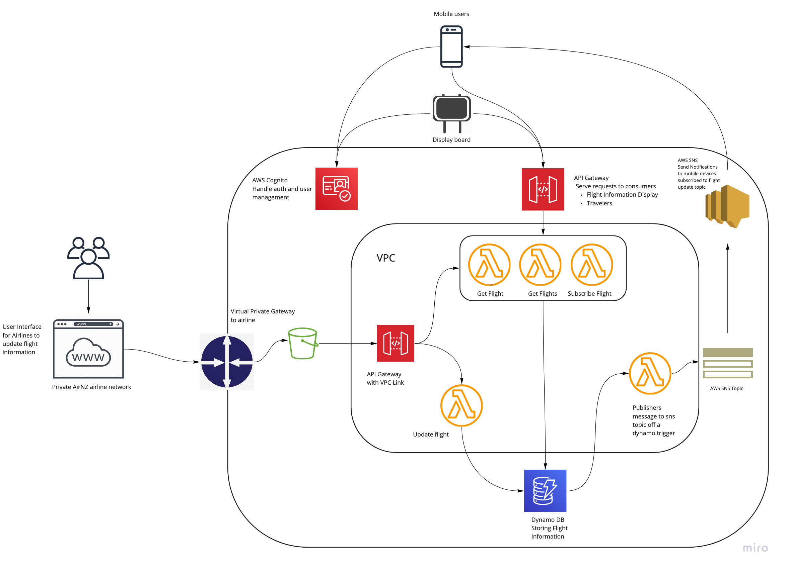

## Overview
All components will be hosted in a new AWS account with a configured VPC across multiple AZs and appropriate  subnets for the application security and access control.

All services required are provided by AWS and will be built, maintained and supported by the team responsible for the system operating in a DevOps manner. The reason for the chosen technologies relates to the availability of service offered by AWS as well as the primary knowledge and skill set available. 

### AWS Services
* Cognito
* API Gateway
* VPC
* Virtual Private gateway
* Lambda
* S3
* SNS
* Dynamo db
* Cloud watch

### Infrastructure as Code
Having the infrastructure as code and in a git repo has the benefits of being version controlled and making sure we have the same resource configuration across different environments. Deployment of all cloud resources can be done using Cloud formation or an alternative called Terraform which aids in cross cloud resource definitions. 

### Infrastructure Diagram
The below diagram is an example of what the first iteration of the infrastructure would look like. 
