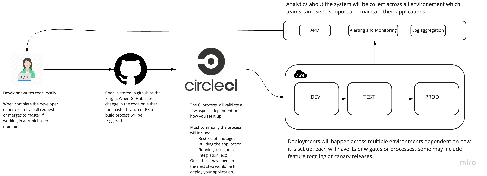

## Overview
All systems will have fit for purpose CI/CD pipelines building, testing and intergrating to a the appropraite environment on every commit to enable fast feedback.

All repositories will live on GitHub and we will user circle ci to perform builds and releases. Circle ci allows us to define our pipelines as code and this way we can keep our deployment mechanism close to our application under version control. 

### Technology
* Github
* Circle CI
* AWS

### Example CICD process

