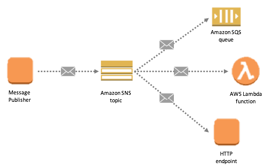

## Overview

Users need to be able to subscribe to notifications about the changes in flight information. Leveraging and building upon the designs of the web-api and airline-application we can use cloud services provided by AWS to handle our notification mechanism.

## Subscribing

The web api will expose a subscribe enpoint which will allow the users get notifications for flights they are interested in. The subscriptions will be saved in the dynamo db as a new table to keep track of what flights users are interested in. 

## Publishing
A dynamo db trigger will be set up on the flights table, this trigger will invoke a Lambda which will publish a message with the change to the aws topic. 

## Notifying

AWS SNS will be responsible for sending the Push notifications. If we need to introduce other means of notifications like email or sms we can implement a fan out pattern using SNS to achieve this. 

## Reference Architecture
