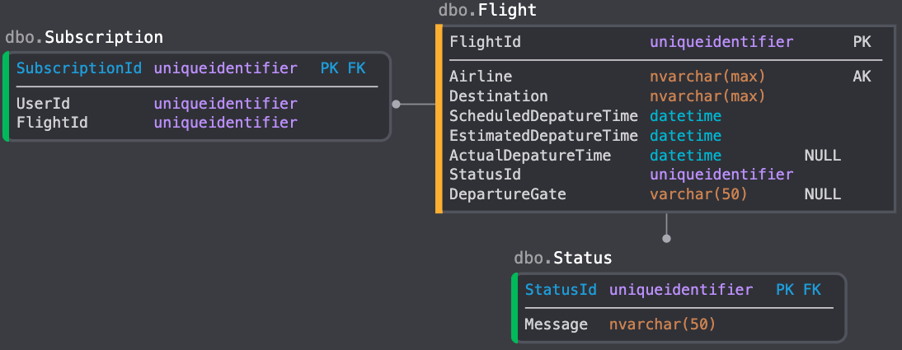

# Overview
 The web api will be developed based on the [contract](flight-api-spec.yml) supplied in this repo. The Contract follows an OpenAPI 3.0 Spec which serves as the consumers documention and can also be used to define the AWS API Gateway resouce endpoints for which applications will interact with. 

 I have choosen to use one api at this point for both mobile clients and digital information boards.

 You can view the hosted contract <a href="https://app.swaggerhub.com/apis/AashiqDurga/flight-api/1.0" target="_blank">here</a>

 ## Technology
 Given the scope of this application a simple serverless architecture can be used to leverage both low costs and scalability provided by AWS. 

 ### API
  [Serverless Cli](https://www.serverless.com/) was used to create the [example](flight-api) application that has been provided. The specific AWS Lambda functions are written in NodeJS with TypeScript.

  NodeJS is a widely used technology with a ecosystem that can be made easily available to any local or cloud environment. To get going quickly with serverless it is a good choice as there is a wide community support if any issues may be faced while developing the system. 

  With the given approach we could use the API Gateway as an abstraction to other services we may want to build. We could also swap out our lambdas for containerized apis built on a different stack if we wish.

  Using a serverless approach helps us will the scalling concern for unknown periods of time when we may have spikes in requests. This architecture has a few case studies done to prove the benefit of serverless and cloud native systems. 
 
 ### CICD
 An example cicd pipeline (circle ci) has been provided to automate the deploments of our API. 
 This allows us to continuously intergrate and get feedback from our system be it running unit tests or  publishing it to a staging environment for test apps and displays to consume.

 ### Database
 DynamoDB will be used as our datastore to keep things simple by leverageing managed services in AWS. 
 We could also use an RDS (MS Sql Server) as I have provided an example data structure. 
 
 I dont think we need a relational store for this as there is some additional overhead to deal with it. 
 
 Dynamo db provides easy to consume sdks for a nodejs application and requires no setup as we will do this via Serverles Cli initialization. 

 #### Data Model
The data model can be represented simple as a json object given a NoSql database will be used in this design.

The flight-api-example has TS models defined.

Flight
```
 {
    "id":"1b22455e-20f7-4e9e-a48b-6505dcfe3539",
    "airline":"Air New Zealand",
    "flightNumber": "NZ06",
    "destination":"Melbourne",
    "scheduledDepartureTime":"2020-01-13T17:30:00.000Z",
    "estimateDepartureTime":"2020-01-13T17:30:00.000Z",
    "actualDepartureTime":"2020-01-13T17:30:00.000Z",
    "status":"On Time",
    "depatureGate":"G6"

} 
```
Subscription
```
{
    "id":"ff23afac-81c8-4395-9f4b-bdb1236d0b38",
    "userId": "03189378-6502-47d0-988d-344213ea453f",
    "flights":["ceab8c3d-07f3-49e2-ac30-ccf85d971151"]
}
```

Alterantive Design for a SQL database
